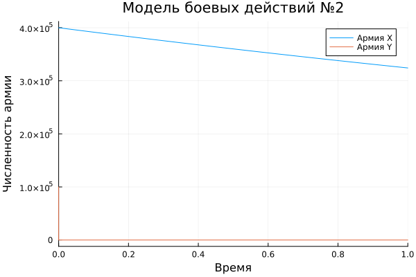

---
## Front matter
lang: ru-RU
title: Лабораторная работа №3
subtitle: Модель боевых действий
author:
  - Ендонова Арюна Валерьевна
institute:
  - Российский университет дружбы народов, Москва, Россия

## i18n babel
babel-lang: russian
babel-otherlangs: english

## Formatting pdf
toc: false
toc-title: Содержание
slide_level: 2
aspectratio: 169
section-titles: true
theme: metropolis
header-includes:
 - \metroset{progressbar=frametitle,sectionpage=progressbar,numbering=fraction}
 - '\makeatletter'
 - '\beamer@ignorenonframefalse'
 - '\makeatother'
---

# Информация

## Докладчик

:::::::::::::: {.columns align=center}
::: {.column width="70%"}

  * Ендонова Арюна Валерьевна
  * студентка
  * Российский университет дружбы народов
  * [1132221888@pfur.ru](mailto:1132221888@pfur.ru)
  * <https://github.com/aryunae>

:::
::: {.column width="25%"}


:::
::::::::::::::

## Цель работы

Построить модель боевых действий на языке прогаммирования Julia и посредством ПО OpenModelica.

## Задание

Построить графики изменения численности войск армии $X$ и армии $Y$ для  следующих случаев:

1. Модель боевых действий между регулярными войсками

2. Модель ведение боевых действий с участием регулярных войск и партизанских отрядов

# Выполнение лабораторной работы

## Модель боевых действий между регулярными войсками

$$\begin{cases}
    \dfrac{dx}{dt} = -0.31x(t)- 0.76y(t)+sin(3t)\\
    \dfrac{dy}{dt} = -0.8x(t)- 0.21y(t)+cos(4t)+2
\end{cases}$$

## Модель боевых действий между регулярными войсками

```Julia
function reg(u, p, t)
    x, y = u
    a, b, c, h = p
    dx = -a*x - b*y+sin(3*t)
    dy = -c*x -h*y+cos(4*t)+2
    return [dx, dy]
end
```
## Модель боевых действий между регулярными войсками

```Julia
# начальные условия
u0 = [400000, 100000]
p = [0.31, 0.76, 0.8, 0.21]
tspan = (0,1)
```

## Модель боевых действий между регулярными войсками

```Julia
prob = ODEProblem(reg, u0, tspan, p)
sol = solve(prob, Tsit5())
plot(sol)
```

## Модель боевых действий между регулярными войсками

{#fig:001 width=70%}

## Модель боевых действий между регулярными войсками

```OpenModelica
model lab3
  parameter Real a = 0.31;
  parameter Real b = 0.76;
  parameter Real c = 0.8;
  parameter Real h = 0.21;
  parameter Real x0 = 400000;
  parameter Real y0 = 100000;
  Real x(start=x0);
  Real y(start=y0);
equation
  der(x) = -a*x - b*y+sin(3*time);
  der(y) = -c*x -h*y+cos(4*time)+2;
end lab3;
```

## Модель боевых действий между регулярными войсками

{#fig:002 width=70%}

## Модель ведение боевых действий с участием регулярных войск и партизанских отрядов

$$\begin{cases}
    \dfrac{dx}{dt} = -0.21x(t)-0.7y(t)+sin(10t)\\
    \dfrac{dy}{dt} = -0.56x(t)y(t)-0.15y(t)+cos(10t)
\end{cases}$$


## Модель ведение боевых действий с участием регулярных войск и партизанских отрядов

```Julia
function reg_part(u, p, t)
    x, y = u
    a, b, c, h = p
    dx = -a*x - b*y+sin(10*t)
    dy = -c*x*y -h*y+cos(10*t)
    return [dx, dy]
end
```

## Модель ведение боевых действий с участием регулярных войск и партизанских отрядов

```Julia
u0 = [400000, 100000]
p = [0.21, 0.7, 0.56, 0.15]
tspan = (0,1)\
```

## Модель ведение боевых действий с участием регулярных войск и партизанских отрядов

```Julia
prob2 = ODEProblem(reg_part, u0, tspan, p)
sol2 = solve(prob2, Tsit5())
plot(sol2)
```

## Модель ведение боевых действий с участием регулярных войск и партизанских отрядов

{#fig:003 width=70%}

## Модель ведение боевых действий с участием регулярных войск и партизанских отрядов

{#fig:004 width=70%}

## Модель ведение боевых действий с участием регулярных войск и партизанских отрядов

```
model lab3_v2
  parameter Real a = 0.21;
  parameter Real b = 0.7;
  parameter Real c = 0.56;
  parameter Real h = 0.15;
  parameter Real x0 = 400000;
  parameter Real y0 = 100000;
  Real x(start=x0);
  Real y(start=y0);
equation
  der(x) = -a*x - b*y+sin(10*time);
  der(y) = -c*x*y -h*y+cos(10*time);
end lab3_v2;
```

## Модель ведение боевых действий с участием регулярных войск и партизанских отрядов

{#fig:004 width=70%}

## Модель ведение боевых действий с участием регулярных войск и партизанских отрядов

{#fig:004 width=70%}

## Выводы

В процессе выполнения данной лабораторной работы я построила модель боевых действий на языке прогаммирования Julia и посредством ПО OpenModelica, а также провела сравнительный анализ.

## Список литературы


