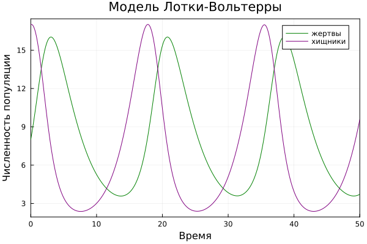
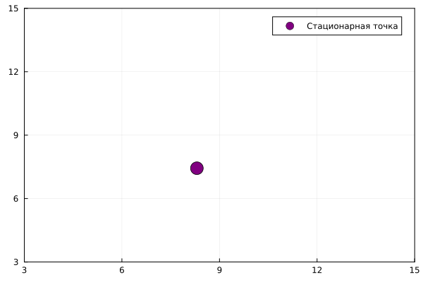
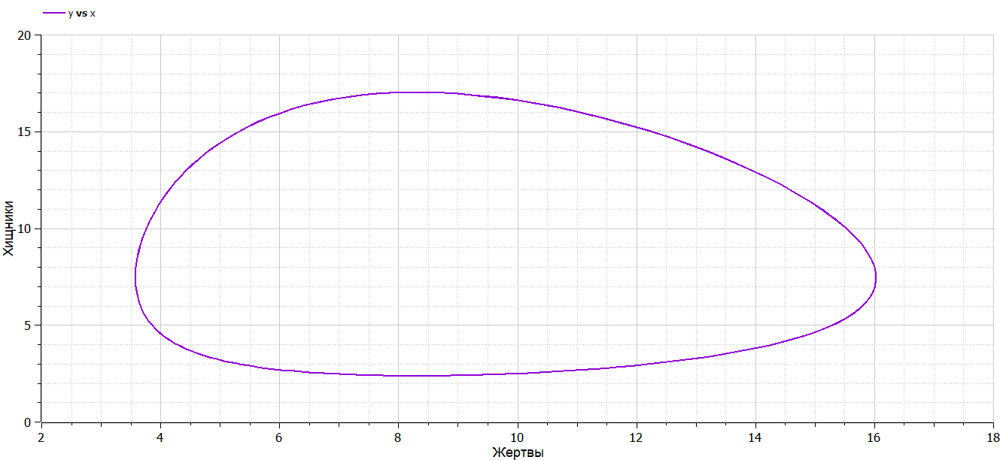

---
## Front matter
title: "Лабораторная работа №5"
subtitle: "Модель Лотки-Вольтерры"
author: "Ендонова Арюна Валерьевна"

## Generic otions
lang: ru-RU
toc-title: "Содержание"

## Bibliography
bibliography: bib/cite.bib
csl: pandoc/csl/gost-r-7-0-5-2008-numeric.csl

## Pdf output format
toc: true # Table of contents
toc-depth: 2
lof: true # List of figures
lot: false # List of tables
fontsize: 12pt
linestretch: 1.5
papersize: a4
documentclass: scrreprt
## I18n polyglossia
polyglossia-lang:
  name: russian
  options:
	- spelling=modern
	- babelshorthands=true
polyglossia-otherlangs:
  name: english
## I18n babel
babel-lang: russian
babel-otherlangs: english
## Fonts
mainfont: PT Serif
romanfont: PT Serif
sansfont: PT Sans
monofont: PT Mono
mainfontoptions: Ligatures=TeX
romanfontoptions: Ligatures=TeX
sansfontoptions: Ligatures=TeX,Scale=MatchLowercase
monofontoptions: Scale=MatchLowercase,Scale=0.9
## Biblatex
biblatex: true
biblio-style: "gost-numeric"
biblatexoptions:
  - parentracker=true
  - backend=biber
  - hyperref=auto
  - language=auto
  - autolang=other*
  - citestyle=gost-numeric
## Pandoc-crossref LaTeX customization
figureTitle: "Рис."
tableTitle: "Таблица"
listingTitle: "Листинг"
lofTitle: "Список иллюстраций"
lotTitle: "Список таблиц"
lolTitle: "Листинги"
## Misc options
indent: true
header-includes:
  - \usepackage{indentfirst}
  - \usepackage{float} # keep figures where there are in the text
  - \floatplacement{figure}{H} # keep figures where there are in the text
---

# Цель работы

Исследовать математическую модель Лотки-Вольерры.

# Задание

Для модели «хищник-жертва»:

$$\begin{cases}
    &\dfrac{dx}{dt} = - 0.29 x(t) + 0.039 x(t)y(t) \\
    &\dfrac{dy}{dt} = 0.49 y(t) - 0.059 x(t)y(t)
\end{cases}$$

Построить график зависимости численности хищников от численности жертв,
а также графики изменения численности хищников и численности жертв при
следующих начальных условиях:
$x_0 = 8, y_0 = 17.$ 
Найти стационарное состояние системы.

# Теоретическое введение

Моде́ль Ло́тки — Вольте́рры (модель Ло́тки — Вольтерра́[1]) — модель взаимодействия двух видов типа «хищник — жертва», названная в честь своих авторов (Лотка, 1925; Вольтерра 1926), которые предложили модельные уравнения независимо друг от друга.

Такие уравнения можно использовать для моделирования систем «хищник — жертва», «паразит — хозяин», конкуренции и других видов взаимодействия между двумя видами[2].

В математической форме предложенная система имеет следующий вид:

$$\begin{cases}
    &\dfrac{dx}{dt} = \alpha x(t) - \beta x(t)y(t) \\
    &\dfrac{dy}{dt} = -\gamma y(t) + \delta x(t)y(t)
\end{cases}$$

где 
$\displaystyle x$ — количество жертв, 

$\displaystyle y$ — количество хищников, 

${\displaystyle t}$ — время, 

${\displaystyle \alpha ,\beta ,\gamma ,\delta }$ — коэффициенты, отражающие взаимодействия между видами [@wiki].

# Выполнение лабораторной работы

Для того, чтобы построить графики нам нужно сначала решить систему ДУ. Для этого мы используем язык программирования Julia и ПО OpenModelica, затем сравним результат.

## Реализация на Julia  

Напишем код для решения системы ДУ, используя библиотеку `DifferentialEquations.jl`, а затем построим графики с помощью библиотеки `Plots`.

```Julia

# Используемые библиотеки
using DifferentialEquations, Plots;

# задания системы ДУ, описывающей модель Лотки-Вольтерры
function LV(u, p, t)
    x, y = u
    a, b, c, d = p
    dx = a*x - b*x*y
    dy = -c*y + d*x*y
    return [dx, dy]
end

# Начальные условия
u0 = [8,17]
p = [-0.29, -0.039, -0.49, -0.059]
tspan = (0.0, 50.0)
prob = ODEProblem(LV, u0, tspan, p)
sol = solve(prob, Tsit5())

# Постановка проблемы и ее решение
plot(sol, title = "Модель Лотки-Вольтерры", xaxis = "Время", yaxis = "Численность популяции", label = ["жертвы" "хищники"], c = ["green" "purple"], box =:on)
```

В результате получаем следующие графики изменения численности хищников и численности жертв (рис. [-@fig:001]) и зависимости численности хищников от численности жертв (рис. [-@fig:002]).

{#fig:001 width=70%}

{#fig:002 width=70%}

Графики периодичны, фазовый портрет замкнут, как и должно быть в жесткой модели Лотки-Вольтерры.

Далее найдем стационарное состояние системы по формуле:

$$\begin{cases}
  &x_0 = \dfrac{\gamma}{\delta}\\
  &y_0 = \dfrac{\alpha}{\beta}
\end{cases}
$$

Получим, что $x_0 = \dfrac{0.29}{0.039} = 8.305084745762713$, а $y_0 = \dfrac{0.49}{0.059}=7.435897435897435$

Проверим, что эта точка действительно является стационарной, подставив ее в начальные условия.

```Julia
x_c = p[3]/p[4]
y_c = p[1]/p[2]
u0_c = [x_c, y_c]
prob2 = ODEProblem(LV, u0_c, tspan, p)
sol2 = solve(prob2, Tsit5())

plot(sol2, xaxis = "Жертвы", yaxis = "Хищники", label = ["Жертвы" "Хищники"], c = ["green" "purple"], box =:on)
```

Получим график из двух прямых, параллельных оси абсцисс, то есть численность и жертв, и хищников не меняется, как м должно быть в стационарном состоянии (рис. [-@fig:003]).

{#fig:003 width=70%}

Фазовый портрет в стационарном состоянии выглядит следующим образом (рис. [-@fig:004]).

{#fig:004 width=70%}

## Реализация на OpenModelica

Зададим параметры и систему ДУ.
```
model lab5_1
  parameter Real a = -0.29;
  parameter Real b = -0.039;
  parameter Real c = -0.49;
  parameter Real d = -0.059;
  parameter Real x0 = 8;
  parameter Real y0 = 17;

  Real x(start=x0);
  Real y(start=y0);
equation
    der(x) = a*x - b*x*y;
    der(y) = -c*y + d*x*y;
end lab5_1;
```

Выполним симуляцию на интервале от (0, 50), который брали для Julia и получим следующие графики изменения численности хищников и численности жертв (рис. [-@fig:005]) и зависимости численности хищников от численности жертв (рис. [-@fig:006]).

{#fig:005 width=70%}

{#fig:006 width=70%}

Графики периодичны, фазовый портрет замкнут, как и должно быть в жесткой модели Лотки-Вольтерры.

Также построим тут изменения численности хищников и численности жертв в стационарном состоянии.

```
model lab5_2
  parameter Real a = -0.29;
  parameter Real b = -0.039;
  parameter Real c = -0.49;
  parameter Real d = -0.059;
  parameter Real x0 = 0.49/0.059;
  parameter Real y0 = 0.29/0.039;

  Real x(start=x0);
  Real y(start=y0);
equation
    der(x) = a*x - b*x*y;
    der(y) = -c*y + d*x*y;
end lab5_2;
```

Получим график, в котором численность жертв и хищников постоянна(рис. [-@fig:007]).

{#fig:007 width=70%}

# Сравнение построения модели на Julia и в OpenModelica

Полученные графики идентичны. Никаких особых различий не видно.

# Выводы

В результате выполнения лабораторной работы я построила математическую модель Лотки-Вольтерры на Julia и в OpenModelica.

# Список литературы{.unnumbered}

::: {#refs}
:::
